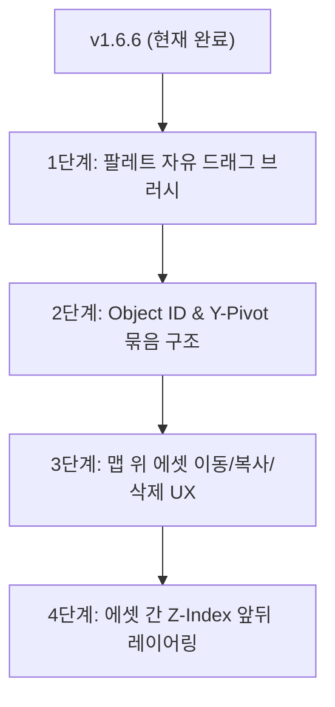

# 📜 온하우스(Onhouse) 맵 에디터 & 오브젝트 아키텍처 회의 결과 보고서

> **작성일시**: 2026-07-23  
> **프로젝트**: 온하우스 (Onhouse) 메타버스  
> **버전 기준**: `v1.6.6` 완료 후  
> **목적**: 맵 에디터 다중 타일(Multi-tile) 오브젝트 처리 및 깊이(Y-Sorting) 렌더링 아키텍처 고도화 설계 정리 (집에서 연속 작업용)

---

## 1. 개요 및 배경 (Background)
* **완료된 작업 (`v1.6.3`)**: 각 사용자별 캐릭터 맵 출력 크기(`charSize`)를 실시간 소켓으로 동기화하여, 내 화면과 상대방 화면 간 캐릭터 크기 불일치 버그 수정 완료.
* **현상 진단 (`v1.6.4` ~ `v1.6.6`)**:
  * 3x2, 3x3 크기의 대형 에셋(나무, 건물 등)에서 통행 장벽을 끄고 나뭇잎 안쪽으로 걸어갈 때, 개별 `16x16` 타일 단위 Y-Sorting으로 인해 캐릭터 머리는 상단 나뭇잎 위로 튀어나오고 하체는 중간 잎 아래로 들어가는 **반토막 잘림(Z-clipping) 현상** 발생.
  * 2층 가구/장식 레이어 전체를 사람 위로 올릴 경우(`v1.6.5`), 캐릭터가 집이나 건물 앞(아래)으로 걸어 나올 때 지붕이 머리를 덮어버리는 부작용이 발생하여 `v1.6.6`에서 원복 처리함.

---

## 2. 현상 원인 분석 (Root Cause Analysis)
* **단순 타일 단위 Y-Sorting의 한계**:
  * 나무 상단 잎(`Row 9`), 나무 중단 잎(`Row 10`), 나무 하단 뿌리(`Row 11`)가 각자 독립된 타일로 Y-sorting 계산됨.
  * 캐릭터가 `Row 10`(중단 잎) 위치로 걸어 들어가면, `Row 9` 타일보다는 아래에 있고 `Row 10` 타일보다는 위에 놓이게 되어 캐릭터가 상/하로 잘리는 연출 한계 발생.

---

## 3. 합의된 메타버스 오브젝트 스튜디오 설계 방향 (Agreed Design)

### 🎨 A. 타일셋 팔레트 자유 영역 드래그 선택 (Custom Rectangular Selection)
* **기존**: `1x1`, `2x2`, `3x3` 고정 클릭 프리셋 방식.
* **개선**: 오른쪽 타일 팔레트 시트 이미지 위에서 마우스 드래그로 `1x3`, `4x2` 등 **원하는 영역을 자유롭게 사각형 드래그로 선택**하여 맵에 바로 찍을 수 있는 브러시 기능 제공.

---

### 📦 B. 오브젝트 단위 자동 묶음 (Object Stamp Grouping)
* **원리**: 
  * 팔레트에서 선택한 다중 타일 에셋을 맵에 배치할 때, 맵 데이터에 타일 번호만 저장하는 것이 아니라 해당 타일 묶음 전체에 **동일한 오브젝트 ID (`objectId: "tree_101"`)**와 **오브젝트 최하단 Y 피벗(Pivot Point)** 정보를 부여.
* **렌더링 방식**:
  * 렌더링 시 타일 개별 16x16 높이가 아닌 **오브젝트 최하단 뿌리 Y좌표 기준**으로 캐릭터와 Y-Sorting 수행.
  * 캐릭터가 나뭇잎 숲 안쪽으로 들어가면 **나무 6개 타일 전체(상단+중단+하단)가 통째로 캐릭터 위를 자연스럽게 덮음**.
  * 캐릭터가 뿌리 아래로 나오면 **캐릭터 전체가 나무 앞으로** 나와서 머리부터 발끝까지 깨끗하게 노출.

---

### 🖱️ C. 맵 위 스마트 오브젝트 편집 UX (Smart Object Editing)
1. **오브젝트 선택 & 이동**: 맵에 배치된 에셋 클릭 시 **오브젝트 선택 바운딩 박스** 표시 ➡️ 마우스로 원하는 위치로 자유 이동.
2. **복사 & 삭제**: 
   * `Ctrl+C` / `Ctrl+V`로 동일 에셋 복사 배치.
   * `Delete` 키로 에셋 묶음 전체 한꺼번에 삭제.
3. **삭제 보호**: 오브젝트 타일 중 일부 조각만 클릭하더라도 조각만 깨져서 삭제되지 않고 오브젝트 묶음 전체가 같이 지워지도록 보호 로직 탑재.

---

### 🪜 D. 에셋 간 Z-Index 순서 제어 (Asset Z-Ordering)
* 에셋끼리 맵 위에서 겹쳐 배치 가능 (예: 책상 위에 컴퓨터/커피잔, 집 뒤에 큰 나무).
* 에셋 선택 시 **`맨 앞으로 가져오기 (Bring to Front)` / `맨 뒤로 보내기 (Send to Back)`** z-index 조절 기능 제공.

---

## 4. 향후 로드맵 (Roadmap for Home Work)

1. **1단계**: 타일셋 팔레트 마우스 자유 영역 드래그 선택 브러시 개발
2. **2단계**: `MapDefinition`에 `objects` 스키마 추가 및 오브젝트 단위 Y-Pivot 렌더링 구현
3. **3단계**: 맵 편집 모드에서 에셋 마우스 드래그 이동/복사(`Ctrl+C`/`Ctrl+V`)/삭제(`Delete`) 스마트 UX 탑재
4. **4단계**: 에셋 간 z-index 순서 변경 UI 탑재

---

> 💡 **참고**: 본 문서는 집 또는 다음 작업 시 맵 에디터 고도화를 신속히 이어서 진행하기 위한 회의 정리 파일입니다.
